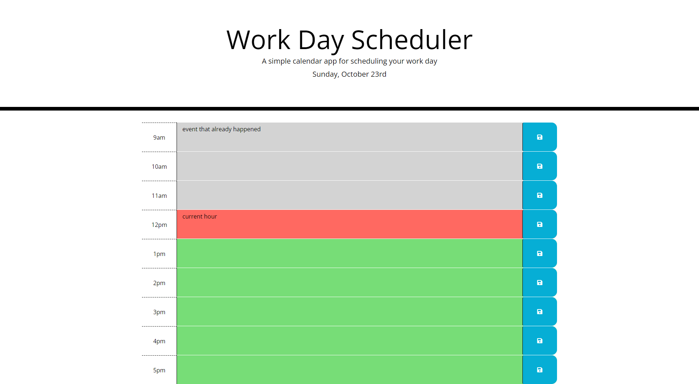
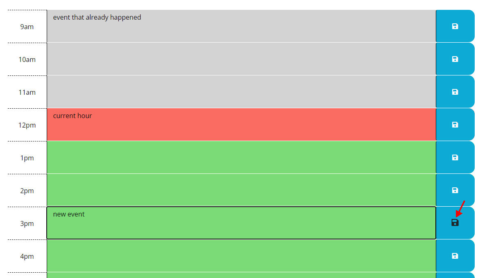
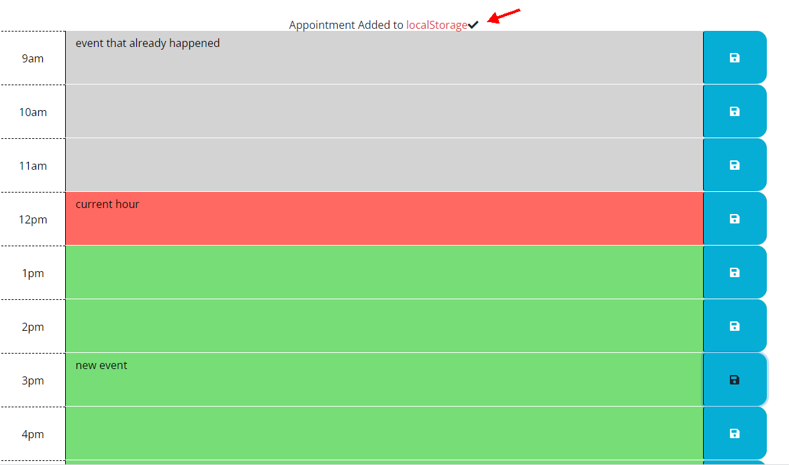

# Rutgers Bootcamp Challenge 5 - Work Day Scheduler using Third Party APIs

## Description
This website allows people to manager their daily schedules. 
 
User Story 
AS AN employee with a busy schedule 
I WANT to add important events to a daily planner 
SO THAT I can manage my time effectively 
 
Acceptance Criteria 
GIVEN I am using a daily planner to create a schedule 
WHEN I open the planner 
THEN the current day is displayed at the top of the calendar 
WHEN I scroll down 
THEN I am presented with time blocks for standard business hours 
WHEN I view the time blocks for that day 
THEN each time block is color-coded to indicate whether it is in the past, present, or future 
WHEN I click into a time block 
THEN I can enter an event 
WHEN I click the save button for that time block 
THEN the text for that event is saved in local storage 
WHEN I refresh the page 
THEN the saved events persist 
  

## Table of Contents

- [Description](#description)
- [Installation](#installation)
- [Usage](#usage)
- [Credits](#credits)
- [License](#license)
- [Badges](#badges)
- [Features](#features)
- [How-to-Contribute](#how-to-contribute)
- [Tests](tests)

## Installation

No installation is needed to use this application. 

Here's a link to the GitHub repo for this project:
https://github.com/abrownstein2022/work-day-scheduler
## Usage
Just click on the link below to use this application:
https://abrownstein2022.github.io/work-day-scheduler

This calendar displays the background of the current timeblock in red, past timeblocks in gray and future timeblocks in green.

Click into a timeblock to add, change or remove text.  Please remember to press the Save button on the far right of the current row to save your changes.  

Your text will be saved in localStorage.  This means that when you refresh the page, your data will still be there unless you change it.

Please refer to the screenshots and animation below to see the application being used.
    

    

## Credits
N/A

## License

N/A

## Badges

N/A

## Features

The main features in this project are:
People can enter events into this easy-to-use workday calendar and refer to it throughout the day.

The calendar display the current hour in red, past events in gray and future events in green.

Once you enter text for your task, press the Save icon on the right to see a message that your entry has been saved.  

## How-to-Contribute

N/A

## Tests

The user does not need to do any tests.  This project was tested thoroughly.